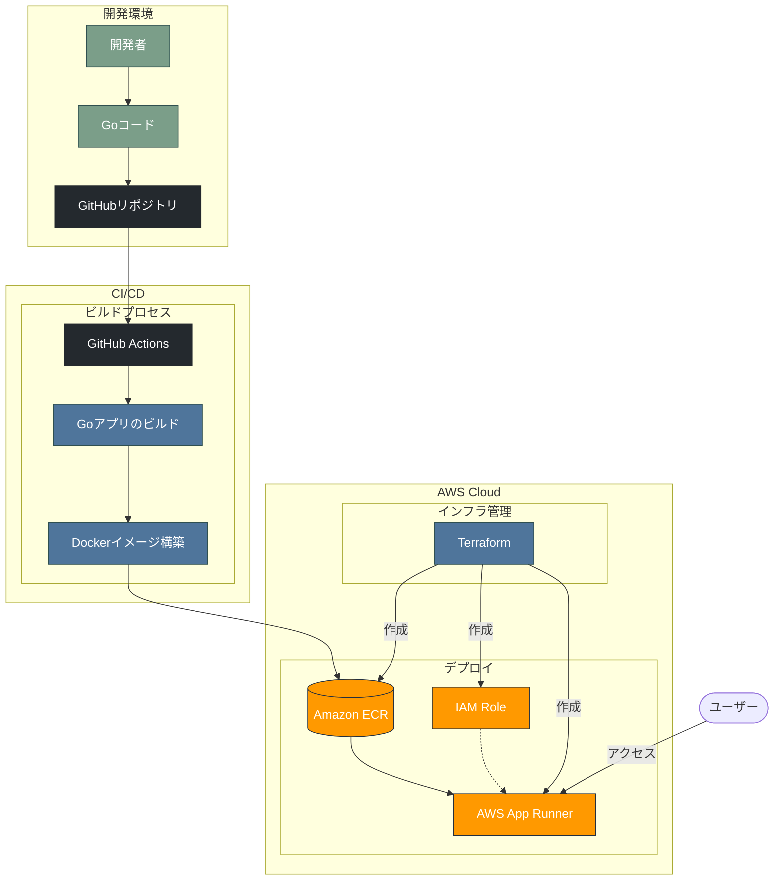

# Go App Runner

AWS App Runnerを使用したGoアプリケーションの自動デプロイプロジェクト

## 概要

このリポジトリには、AWS App RunnerにデプロイするためのシンプルなGoウェブアプリケーションが含まれています。TerraformによるインフラストラクチャのプロビジョニングとGitHub Actionsによる継続的なデプロイ（CI/CD）を行います。

## アーキテクチャ



## 技術スタック

- **バックエンド**: Go 1.21
- **インフラストラクチャ**: AWS App Runner, Amazon ECR
- **IaC**: Terraform
- **CI/CD**: GitHub Actions

## 前提条件

- AWS CLIがインストールされ、正しく設定されていること
- Terraformがインストールされていること
- Dockerがインストールされていること

## セットアップ手順

### 1. インフラストラクチャのプロビジョニング

```bash
# 必要な値を terraform.tfvars に設定
cp terraform.tfvars.example terraform.tfvars
# 値を編集
vi terraform.tfvars

# Terraformの初期化と適用
make tf-init
make tf-apply
```

### 2. GitHub Actionsの設定

1. GitHubリポジトリの「Settings」→「Secrets and variables」→「Actions」に移動
2. 以下のシークレットを追加:
   - `AWS_ACCESS_KEY_ID`
   - `AWS_SECRET_ACCESS_KEY`
3. GitHubリポジトリの「Settings」→「Environments」で「production」環境を作成
4. 必要に応じて「Required reviewers」を設定

### 3. ローカル開発

```bash
# 依存関係のインストール
make deps

# ローカルでの実行
make run

# テストの実行
make test

# Dockerイメージのビルド
make docker-build
```

## ディレクトリ構造

```
.
├── .github/workflows  # GitHub Actionsのワークフロー定義
├── scripts            # 補助スクリプト
├── terraform.tfvars   # Terraform変数値（.gitignoreに含まれる）
├── main.tf            # Terraformのメイン設定ファイル
├── main.go            # Goアプリケーションのエントリーポイント
├── go.mod             # Goの依存関係管理
├── Dockerfile         # Dockerコンテナ定義
└── README.md          # プロジェクト説明
```

## デプロイフロー

1. `main` ブランチへのプッシュで GitHub Actions ワークフローがトリガーされる
2. Go コードのビルドと Docker イメージの構築
3. イメージを Amazon ECR にプッシュ
4. AWS App Runner のオートデプロイメント機能により自動的にデプロイ

## 環境変数

Goアプリケーションは以下の環境変数を使用します:

- `PORT`: アプリケーションが待ち受けるポート（デフォルト: 8080）

## メンテナンス

```bash
# Terraformで作成されたリソースの確認
make tf-show

# 変更の適用前に確認
make tf-plan

# クリーンアップ（全リソースの削除）
make tf-destroy
```

## 注意点

- `terraform.tfvars` ファイルには機密情報が含まれる可能性があるため、バージョン管理には含めないでください
- プロダクション環境での使用前に、セキュリティ設定を見直してください